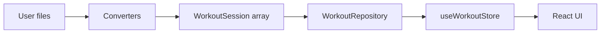

# Agent and contributor guide

This file summarizes how the app is structured so humans and coding agents can extend it safely.

## Purpose

Local-first workout analytics dashboard. Users import CSV/JSON from mobile apps; data lives in the browser (`localStorage`), not in this repository.

## Tech stack

Next.js 15 (App Router), React 19, TypeScript (strict), Tailwind v4, shadcn/ui (Base UI), Zustand with `persist`, Recharts, PapaParse, JSZip.

## Directory map

| Path | Role |
|------|------|
| `src/app` | Routes and layouts (`page.tsx`, `layout.tsx`). |
| `src/components` | UI by area: `dashboard/`, `history/`, `import/`, `layout/`, shadcn `ui/`. |
| `src/lib` | Pure logic, persistence, import converters. Prefer no React here. |
| `src/lib/workout-stats/` | Aggregations for dashboard (volume, weeks, muscle breakdown). Public API via `index.ts`. |
| `src/lib/storage/` | `WorkoutRepository` + `localStorage` implementation. |
| `src/lib/converters/` | Per-format parsers implementing `WorkoutConverter`. |
| `src/stores` | Client global state (Zustand). |
| `src/hooks` | React hooks that are not Zustand stores (e.g. import flow). |
| `src/types` | Domain types (`WorkoutSession`, `UserId`, etc.). |

## Data flow

- **Import**: `convertWithDetection` / `detectConverter` in [`src/lib/converters/registry.ts`](src/lib/converters/registry.ts) produce `WorkoutSession[]`. The UI calls `useWorkoutStore.getState().addImported(sessions)`, which merges via `addSessions` (dedup by session `id`).
- **Reads**: Components call `useWorkoutStore` selectors or `refresh()` after mutations. Sessions are loaded from `getWorkoutRepository().getSessions("all")`.
- **User filter**: `selectedUser` is persisted (`training-dashboard:user`); full session list is kept in memory after load.

## Extension points

### New import format

1. Add a module under `src/lib/converters/<name>.ts` implementing [`WorkoutConverter`](src/lib/converters/types.ts) (`id`, `label`, `detect`, `convert`).
2. Register it in [`src/lib/converters/registry.ts`](src/lib/converters/registry.ts) on the `converters` array (order matters: first `detect` match wins).
3. Document the format briefly in [`README.md`](README.md) under Import.

### New dashboard metrics

Add pure functions under [`src/lib/workout-stats/`](src/lib/workout-stats/) in the appropriate module (or a new file) and re-export from [`src/lib/workout-stats/index.ts`](src/lib/workout-stats/index.ts). Consume from components with `import { ... } from "@/lib/workout-stats"`.

### Persistence changes

Implement or extend [`WorkoutRepository`](src/lib/storage/types.ts) and wire `getWorkoutRepository()` in [`src/lib/storage/index.ts`](src/lib/storage/index.ts).

## Commands

| Command | Description |
|---------|-------------|
| `npm run dev` | Development server (Turbopack). |
| `npm run build` | Production build. |
| `npm run lint` | ESLint. |
| `npm run typecheck` | `tsc --noEmit` (fast typecheck). |
| `npm run test` | Vitest (unit tests for `src/lib`). |
| `npm run test:watch` | Vitest watch mode. |

## Conventions

- Path alias: `@/` → `src/` (see `tsconfig.json`).
- Client components: mark with `"use client"` at top of file.
- Keep imports at the top of the file (no dynamic `import()` for app code unless justified).
